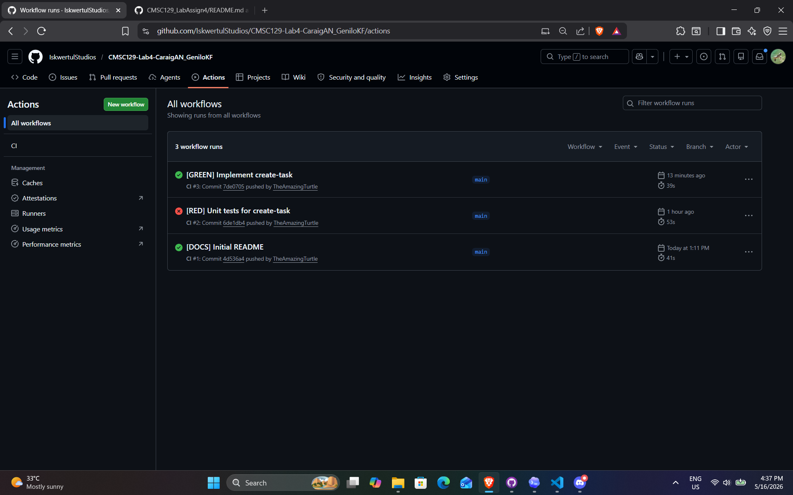

# Harvest Tasks

A cozy farming-themed task manager built with React where each task is a plant that grows as you complete subtasks.

## Overview

Harvest Tasks turns productivity into a small farming loop:

- Each task maps to one plant.
- Subtasks are required before a task can be created.
- Checking subtasks increases completion percentage.
- Plant visuals evolve through six growth stages.
- Completing all subtasks reaches the final harvest stage.

All data is stored client-side in `localStorage` (no backend, no accounts).

## Core Mechanics

### Forced subtask creation
A task is valid only when:

- The title is non-empty.
- At least one subtask is non-empty.

### Plant growth stages
Stage selection is based on completion ratio (`completed / total`):

- `seedling`: 0% to <20%
- `sprout`: 20% to <40%
- `plant`: 40% to <60%
- `bigplant`: 60% to <80%
- `tree`: 80% to <100%
- `fruit`: 100%

## User Stories

1. As a farmer, I want to create a task with at least one subtask so I can track farm work.
2. As a farmer, I want to check subtasks and watch my plant grow so I stay motivated.
3. As a farmer, I want to delete completed or unwanted tasks so I can keep my farm tidy.

## Tech Stack

| Concern | Choice |
|---|---|
| UI Framework | React 19 + Vite |
| Styling | Plain CSS with custom properties |
| Data Persistence | `localStorage` |
| Unit + Integration Testing | Jest |
| System Testing | Playwright |
| CI | GitHub Actions |
| Deployment | Vercel |

## Suggested Project Structure

```text
harvest-tasks/
|-- package.json
|-- package-lock.json
|-- babel.config.cjs
|-- jest.config.js
|-- vite.config.js
|-- playwright.config.js
|-- .github/
|   `-- workflows/
|       `-- ci.yml
|-- src/
|   |-- main.jsx
|   |-- App.jsx
|   |-- index.css
|   |-- lib/
|   |   |-- taskLogic.js
|   |   `-- storage.js
|   `-- components/
|       |-- TaskForm.jsx
|       |-- TaskList.jsx
|       |-- TaskCard.jsx
|       `-- PlantIcon.jsx
`-- tests/
    |-- unit/
    |   `-- taskLogic.test.js
    |-- integration/
    |   `-- storage.test.js
    `-- system/
        `-- taskManager.spec.js
```

## Data Model

### Task

```js
{
  id: string,
  title: string,
  createdAt: number,
  subtasks: [
    {
      id: string,
      text: string,
      done: boolean
    }
  ]
}
```

### Storage key

- `harvest-tasks-v1`

Version the key to support future schema migration.

## Key Modules

### `src/lib/taskLogic.js` (pure logic)

- `getPlantStage(completed, total)`
- `getCompletionPercentage(task)`
- `validateTask(draft)`
- `createTask(draft)`
- `toggleSubtask(task, subtaskId)`

These functions should avoid I/O and browser APIs.

### `src/lib/storage.js` (localStorage adapter)

- `loadTasks()`
- `saveTasks(tasks)`

Use defensive parsing and return `[]` on missing/corrupt data.

## UI Testing Contract (`data-testid`)

System tests depend on these exact values:

- `new-task-btn`
- `task-title-input`
- `subtask-input-{n}`
- `add-subtask-btn`
- `submit-task-btn`
- `task-card`
- `plant-icon` (with `data-stage`)
- `delete-task-btn`

Subtask toggles should be reachable via role `checkbox`.

## Testing Strategy

### Unit tests
Target pure business logic in `taskLogic.js`:

- stage boundaries (0%, 80%, 100%)
- validation constraints (empty title, no subtasks)

### Integration tests
Validate logic + persistence together:

- save/load round-trip
- delete persistence behavior

### System tests
Cover complete user journeys with Playwright:

- create task + subtasks
- progress plant stage via checkboxes
- delete task from farm

Current setup note:

- Unit tests run via Jest in `tests/unit`.
- Integration tests run via Jest in `tests/integration`.
- System tests run via Playwright in `tests/system`.

## Setup

```bash
git clone <your-repo-url>
cd CMSC129-Lab4-CaraigAN_GeniloKF
npm install
npx playwright install chromium
```

## Run Locally

```bash
npm run dev
```

Default local URL:

- `http://localhost:5173`

## Test Commands

```bash
npm run test:unit
npm run test:integration
npm run test:system
npm test
```

## Test Results



Unit scope:
- `validateTask` returns `true`/`false` based on draft validity.
- `createTask` returns `Task` on success, `null` on invalid input.

## CI/CD Notes

Recommended workflow:

- Trigger CI on `push` and `pull_request` to `main`.
- Run unit, integration, then system tests.
- Gate deployment so deploy runs only when tests pass.

## TDD Workflow (Recommended)

Use RED -> GREEN -> REFACTOR per feature slice:

1. Write failing tests first.
2. Implement minimum code to pass.
3. Refactor with behavior unchanged.
4. Keep commits small and atomic.

Suggested commit prefixes:

- `[RED]`
- `[GREEN]`
- `[REFACTOR]`
- `[DOCS]`

## Future Improvements

- Task filtering (all, active, completed)
- Optional due dates
- Stage animation transitions
- Import/export task data
- Accessibility pass (keyboard and screen-reader polish)
